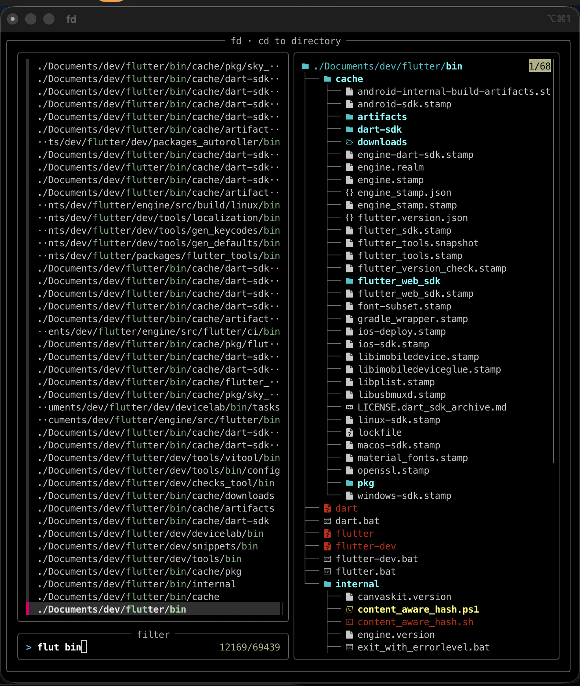
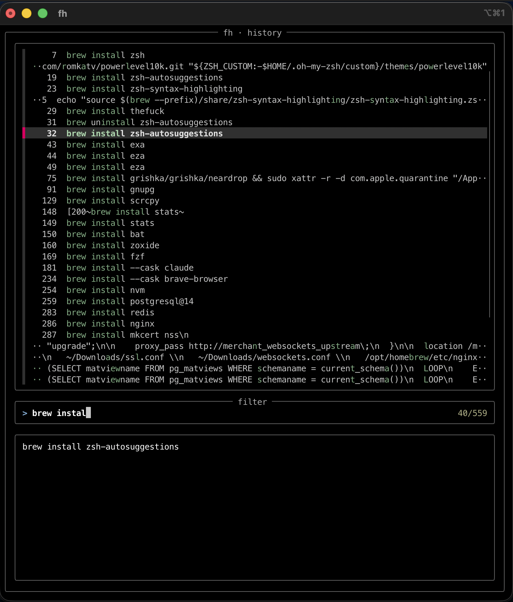
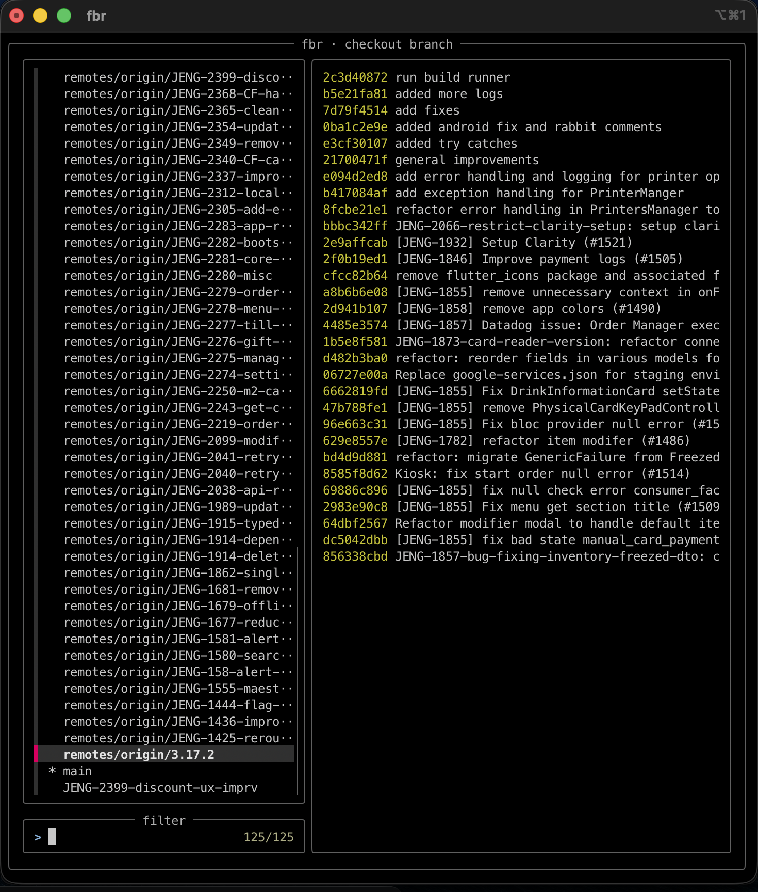

# Uri's macOS setup

> 🇪🇸 [Leer en español](README.md)

A friendly tour of the tools, shell tweaks, and apps I rely on every day on macOS. This is a showcase, not a tutorial — but if you actually want to clone and install the same setup, [`./install.sh`](install.sh) handles it in one shot. See [advanced-readme.md](advanced-readme.md) for the technical details.

> If you're a friend who's curious what I use: keep reading. If you want to actually replicate the setup, jump to [advanced-readme.md](advanced-readme.md).

> 💎 **If you're shopping for apps beyond what I use**, don't miss the [macOS app comparison spreadsheet](#cant-decide-which-app-to-use) further down — calendars, browsers, AI tools, backup, clipboard history, mail clients, all with pros and cons. **It's a gem.**

---

## The shell

I replaced bash with **zsh** — faster, smarter completion, recursive path expansion (`/u/lo/b` → `/usr/local/bin`), better history, and infinitely more customizable. On top of that, [Oh My Zsh](https://github.com/ohmyzsh/ohmyzsh) gives me a sane way to manage plugins and themes.

### Powerlevel10k prompt

The prompt shows: current directory, git status (commits to push/pull, dirty files, stashes), how long the last command took, and a few system stats. Loads instantly thanks to its async rendering — you can start typing before the shell finishes booting.


*Lean, Classic, and Rainbow styles, all configurable via `p10k configure`.*

[Project →](https://github.com/romkatv/powerlevel10k)

### zsh-autosuggestions

Greys out a guess from your history as you type. <kbd>→</kbd> accepts it.

[](https://asciinema.org/a/37390)

*Click the thumbnail for the asciinema cast.*

### zsh-syntax-highlighting

Colors valid commands green and broken ones red *before* you hit enter, so typos are obvious at a glance.

| Without | With |
|---|---|
|  |  |

### zsh-shift-select

Lets you select text on the command line with <kbd>Shift</kbd>+<kbd>←</kbd>/<kbd>→</kbd>/<kbd>Home</kbd>/<kbd>End</kbd>, like in any normal text editor. You can then copy, cut, or overwrite the selection by typing — just like you'd expect. Big quality-of-life win when you're building up a long command and want to move/delete chunks without learning zsh's native chords.

[Project →](https://github.com/jirutka/zsh-shift-select)

### Other Oh My Zsh plugins

- **`aliases`** — run `acs` to list every alias you have loaded, grouped by category. Handy for discovering what's available.
- **`cp`** — adds `cpv`, an `rsync`-backed copy that shows progress.

Want more? The [awesome-zsh-plugins](https://github.com/unixorn/awesome-zsh-plugins) list is the canonical reference, with hundreds of curated plugins.

---

## Better defaults for everyday commands

The basics — `ls`, `cat`, `cd` — replaced with modern equivalents.

| What I type | What actually runs | Why |
|---|---|---|
| `ls` | [`eza`](https://github.com/eza-community/eza) | Colors, icons, git status all baked in |
| `cat` | [`bat`](https://github.com/sharkdp/bat) | Syntax highlighting + line numbers + paging |
| `z <name>` | [`zoxide`](https://github.com/ajeetdsouza/zoxide) | Smart `cd` that learns your habits |

### eza

A drop-in `ls` replacement with icons, colors, and git status integration.


### bat

`cat` with syntax highlighting and automatic paging for long files.


### zoxide

`z <fragment>` jumps to the most-frequently-used directory matching the fragment. After a few weeks you stop typing `cd`.


```sh
z dotfiles      # → ~/dotfiles
z stat          # → ~/some/path/with/stats/
z foo bar       # multi-fragment match
```

### thefuck

Mistyped a command? Type `fuck` and it suggests a fix.


[Project →](https://github.com/nvbn/thefuck)

---

## Aliases

Defined in [zsh/aliases.zsh](zsh/aliases.zsh). All built on top of `eza`.

| Alias | Expands to | Use case |
|---|---|---|
| `ls` | `eza --icons --group-directories-first` | The new ls |
| `la` / `lla` | `ls -la` | Long listing, all files |
| `ld` | `ls -D` | Directories only |
| `lt` | `ls --tree` | Tree view |
| `lgs` | `ls --git` | With git status icons |
| `ltgs` | `ls --git --tree=3` | Tree view + git status, 3 levels deep |
| `lsgs` | `ls --git -l` | Long listing with git status |
| `cat` | `bat` | Syntax-highlighted cat |

Oh My Zsh ships hundreds of additional aliases via its `git` plugin — `gst`, `gco`, `gcam`, `gp`, etc. Run `alias` in the shell to see the full list.

---

## Custom fzf widgets

Four interactive pickers I built on top of [`fzf`](https://github.com/junegunn/fzf), all sharing the same full-bordered preview style. Source in [zsh/functions.zsh](zsh/functions.zsh).

### `fd` — jump to a directory

Fuzzy-search every subdirectory of the current path and `cd` into the chosen one. Live tree preview on the right.

<!-- TODO docs/fd-widget.png — screenshot of `fd` running with the dir list on the left and the eza tree preview on the right -->


### `fh` — re-run a command from history

Browse your shell history and re-run any past command. Live preview shows the full command with syntax highlighting.

<!-- TODO docs/fh-widget.png — screenshot of `fh` mid-search, with one command highlighted and previewed -->


### `fkill` — pick a process to kill

Multi-select processes with <kbd>Tab</kbd>; <kbd>Enter</kbd> sends `kill -9`. Pass a different signal as the first arg (e.g. `fkill 15`).

### `fbr` — checkout a git branch

Local + remote branches with a `git log` preview of whichever is highlighted.

<!-- TODO docs/fbr-widget.png — screenshot of fbr in a real repo with the log preview showing recent commits -->


---

## Apps I install (Homebrew casks)

| App | What it is |
|---|---|
| [Brave](https://brave.com/) | Privacy-respecting browser, my daily driver |
| [iTerm2](https://iterm2.com/) | Terminal replacement: split panes, in-line search, profiles, hotkey window |
| [Raycast](https://www.raycast.com/) | Spotlight on steroids — clipboard history, calculator, snippets, custom scripts |
| [Stats](https://github.com/exelban/stats) | CPU / RAM / disk / network / battery in the menu bar |
| [Rectangle](https://rectangleapp.com/) | Window tiling via keyboard shortcuts (left/right halves, quarters, fullscreen, etc.). Trackpad-gesture alternative: [Swish](https://highlyopinionated.co/swish/) (paid). |
| [Mos](https://mos.caldis.me/) | Smooth mouse-wheel scrolling, with independent scroll direction for mouse and trackpad |
| [KeyClu](https://sergii.tatarenkov.name/keyclu/support/) | Pops up the current app's keyboard shortcuts when you hold a hotkey — great for learning shortcuts |
| [NearDrop](https://github.com/grishka/NearDrop) | Quick Share / Nearby Share for macOS — send & receive files from Android |
| [scrcpy](https://github.com/Genymobile/scrcpy) | Mirror & control an Android device from your Mac, over USB or Wi-Fi |
| [android-platform-tools](https://developer.android.com/tools/releases/platform-tools) | `adb`, `fastboot`, etc. |

### What KeyClu looks like

Hold the hotkey in any app and you get a translucent overlay grouping every shortcut by menu — searchable and scrollable:


### What Stats looks like

The menu bar widgets stay live with CPU / RAM / disk / network / battery numbers and tiny graphs — pick which ones you want and how compact they should be:


Click any of them and you get a detailed popup with breakdowns, history, top processes, and per-component info:


### `scrcpy-select` — pick a device when several Androids are connected

Plain `scrcpy` errors out if more than one Android device is connected (e.g. a phone over USB plus an emulator, or two phones, or USB + ADB-over-Wi-Fi). This little wrapper lists every device returned by `adb devices -l` with its model name, lets you pick one by number, and launches scrcpy on it.

```sh
$ scrcpy-select
Select a device:
0: Pixel_8 [4A0PR2A...]
1: SM-G991U [R5CN...]
Enter number: 1

Launching scrcpy for SM-G991U [R5CN...]
```

Source: [bin/scrcpy-select](bin/scrcpy-select). Symlinked into `~/bin` (which is on your PATH) by `install.sh`.

---

## Custom keyboard layout

I use a custom layout called **"U.S. but Spanish too"**. It's a regular U.S. QWERTY layout, except that pressing <kbd>Option</kbd> + a vowel (or `n`) types the accented Spanish letter directly — no dead-key dance.

| Combo | Output | Combo | Output |
|---|---|---|---|
| <kbd>⌥</kbd>+<kbd>A</kbd> | á | <kbd>⌥</kbd>+<kbd>⇧</kbd>+<kbd>A</kbd> | Á |
| <kbd>⌥</kbd>+<kbd>E</kbd> | é | <kbd>⌥</kbd>+<kbd>⇧</kbd>+<kbd>E</kbd> | É |
| <kbd>⌥</kbd>+<kbd>I</kbd> | í | <kbd>⌥</kbd>+<kbd>⇧</kbd>+<kbd>I</kbd> | Í |
| <kbd>⌥</kbd>+<kbd>O</kbd> | ó | <kbd>⌥</kbd>+<kbd>⇧</kbd>+<kbd>O</kbd> | Ó |
| <kbd>⌥</kbd>+<kbd>U</kbd> | ú | <kbd>⌥</kbd>+<kbd>⇧</kbd>+<kbd>U</kbd> | Ú |
| <kbd>⌥</kbd>+<kbd>N</kbd> | ñ | <kbd>⌥</kbd>+<kbd>⇧</kbd>+<kbd>N</kbd> | Ñ |
| <kbd>⌥</kbd>+<kbd>1</kbd> | ¡ | <kbd>⌥</kbd>+<kbd>/</kbd> | ¿ |

The files live at [config/keyboard-layouts/](config/keyboard-layouts/). `install.sh` copies them automatically; if you want just the layout without running the installer:

1. Copy `U.S. but Spanish too.keylayout` (and the matching `.icns` icon, optional) into `~/Library/Keyboard Layouts/`. Create the folder if it doesn't exist.
2. Open **System Settings → Keyboard → Text Input → Input Sources → Edit → +**, scroll to **Others**, and pick "U.S. but Spanish too".
3. Switch to it from the input-source menu in the menu bar (or with <kbd>Ctrl</kbd>+<kbd>Space</kbd>).

---

## Dev tools running in the background

These mostly run as services or get invoked by other tools — I rarely think about them.

| Tool | What it gives me |
|---|---|
| [`nginx`](https://nginx.org/) | Local reverse proxy for HTTPS dev domains |
| [`nvm`](https://github.com/nvm-sh/nvm) | Multiple Node.js versions side-by-side |
| [`gnupg`](https://gnupg.org/) + [`pinentry-mac`](https://github.com/GPGTools/pinentry) | Sign git commits & tags with GPG |
| [`mkcert`](https://github.com/FiloSottile/mkcert) | Trusted local TLS certificates with no browser warnings |
| [`gh`](https://cli.github.com/) | GitHub from the command line |
| [`fzf`](https://github.com/junegunn/fzf) | The fuzzy finder my custom widgets are built on |
| [`thefuck`](https://github.com/nvbn/thefuck) | Auto-fix the previous mistyped command |
| [`zoxide`](https://github.com/ajeetdsouza/zoxide) | Smarter `cd` |

---

## VS Code

`./install.sh` also installs ~100 VS Code extensions on a fresh machine, listed in [vscode-extensions.txt](vscode-extensions.txt). The major stacks:

- **Web/JS**: ESLint, Prettier, TailwindCSS, GitLens, Pretty TS Errors
- **PHP/Laravel**: Intelephense, Blade Formatter, Laravel Goto-* helpers
- **Flutter/Dart**: Dart, Flutter, bloc, awesome-flutter-snippets
- **Python**: Pylance, Ruff, Jupyter
- **AI**: GitHub Copilot Chat, Codeium, ChatGPT
- **DX**: Docker, EditorConfig, Material Icon Theme, Code Spell Checker

---

## A note on fonts

Most of the icon-rendering above (in eza, the p10k prompt, etc.) requires a [Nerd Font](https://www.nerdfonts.com/font-downloads) to display correctly. I use **MesloLGS Nerd Font**; **Hack Nerd Font** also works well. Set it in iTerm2 → Profiles → Text → Font.

---

## Can't decide which app to use?

Don't know which calendar app to pick, which browser, which AI app, which backup tool, which clipboard-history app, which mail client? I'll leave you [this mega spreadsheet](https://docs.google.com/spreadsheets/d/1HtJN4oQ6oBDFmFaF4Qeq5vCGEU1g-KB1DEz5Sp_OwXo/edit?usp=sharing) that compares a bunch of macOS tools side by side, with pros and cons.

---

## Recommended but I haven't tried them yet

Tools people have suggested to me — listed here so I (and you) don't forget:

- **[FineTune](https://github.com/ronitsingh10/FineTune)** — per-app volume control, up to 4× boost on quiet apps, multi-output routing, EQ, headphone correction. Free, open source, lives in the menu bar. Possible replacement for what `Stats > volume` and the system mixer can't do.
- **[AltTab](https://alt-tab-macos.netlify.app/)** — Windows-style alt-tab for macOS, with thumbnails of every window across spaces. Free.
- **[BetterDisplay](https://github.com/waydabber/BetterDisplay)** (Pro version is paid) — tame external displays: arbitrary resolutions, HiDPI on non-Retina monitors, brightness/contrast/gamma overrides per display. Pairs well with **[MonitorControl](https://github.com/MonitorControl/MonitorControl)** (free, brightness & volume in the menu bar for external displays).
- **[Alfred](https://www.alfredapp.com/)** — the OG Spotlight replacement, the alternative to Raycast. Free core; the Powerpack (workflows, clipboard history, snippets) is paid.
- **[Kitty](https://sw.kovidgoyal.net/kitty/)** and **[Ghostty](https://ghostty.org/)** — GPU-accelerated terminal emulators, significantly more powerful and faster than iTerm2. Kitty is a long-running project with a rich plugin system (kittens); Ghostty is the new kid (2024, by Mitchell Hashimoto of Vagrant/Terraform fame), built around performance and UX. Both free and open source.

---

## Going deeper

Everything above is documented technically — installation, file structure, what's intentionally not committed (SSH keys, GPG private keys, `.zsh_history`), how to sync changes from your live config back into the repo — in [advanced-readme.md](advanced-readme.md).

---

## Got recommendations or feedback?

If there's a tool you swear by that's missing from this list, or a section that's confusing, I'd love to hear it. Open an [issue on GitHub](https://github.com/uristrimber/dotfiles/issues) or reach out wherever you usually find me.
